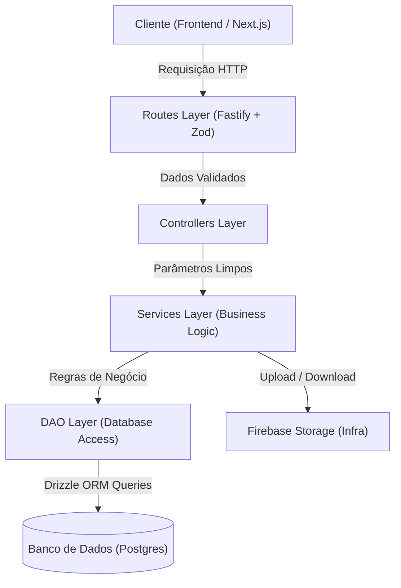

# 🖥️ Harddex - Hardware Indexer & Comparison Platform

> Uma plataforma moderna e robusta para catalogar, buscar e comparar componentes de hardware de computadores, funcionando como uma "Pokedex de Hardware". O projeto é estruturado como um monorepo TypeScript focado em performance, desacoplamento e excelente experiência do usuário.

---

## 📌 Sumário da Documentação

Para facilitar a navegação pelas especificações detalhadas de cada parte do projeto, utilize os links abaixo:

* [👥 Organização da Equipe & Papéis](#-organização-da-equipe--papéis) - Funções de cada desenvolvedor.
* [🛠️ Tecnologias Utilizadas](#%EF%B8%8F-tecnologias-utilizadas) - Detalhamento da stack do backend, frontend e infraestrutura.
* [📐 Arquitetura do Projeto](#-arquitetura-do-projeto) - Visão geral do fluxo e detalhamento de cada camada.
* [📖 Documentações de Camada (API)](#-documentações-de-camada-api) - Links para os guias individuais de rotas, controladores, serviços, acesso a dados e infraestrutura.
* [⚡ Guia de Setup & Execução](#-guia-de-setup--execução) - Como rodar o monorepo localmente.

---

## 👥 Organização da Equipe & Papéis

Nosso time foi estruturado de forma a otimizar as entregas de ponta a ponta, dividindo responsabilidades claras alinhadas com as competências técnicas e operacionais:

*   **Mirela** — *Estruturação do Banco de Dados e Líder Interno*
    *   **Responsabilidades**: Modelagem de dados relacional lógica e física, implementação de schemas do Drizzle ORM, gerenciamento de migrações SQL, coordenação geral do desenvolvimento interno e alinhamento de sprints do time.
*   **Mariana** — *DAOs / Services*
    *   **Responsabilidades**: Implementação das regras de negócio do domínio na camada de Serviços (`api/src/services`) e criação da camada de acesso a dados (DAOs) em `api/src/dao`, assegurando o desacoplamento do banco de dados por meio de interfaces (`IUserDAO`).
*   **Ana** — *Controllers / Routes*
    *   **Responsabilidades**: Mapeamento e segurança das portas HTTP de entrada na camada de Rotas (`api/src/routes`) e orquestração do transporte HTTP na camada de Controladores (`api/src/controllers`), gerenciando schemas de validação com Zod e a documentação do Swagger.
*   **Yago** — *Design e Estruturação do Web*
    *   **Responsabilidades**: Concepção e desenvolvimento do frontend da aplicação web (`web/src`), estruturando a hierarquia do Next.js App Router, implementando o Design System modularizado em CSS e refinando a experiência visual responsiva das telas (Compare, Quiz, Profile, etc.).
*   **Victor** — *Tech Lead & Integração (Front + Back)*
    *   **Responsabilidades**: Líder Técnico Externo e responsável por amarrar a interface frontend (`web`) com as rotas REST do backend (`api`). Gerencia a arquitetura do monorepo, integrações de APIs, padrões globais de desenvolvimento e infraestrutura geral de build/deploy.

---

## 🛠️ Tecnologias Utilizadas

O ecossistema Harddex foi concebido com tecnologias modernas para garantir máxima escalabilidade e produtividade:

### 🌐 Monorepo
*   **PNPM Workspaces**: Gerenciador de pacotes e organizador de múltiplos pacotes em um único repositório, otimizando cache e dependências compartilhadas.

### 🔌 Backend API (`api/`)
*   **Fastify (Node.js)**: Framework web focado em performance extrema e baixo overhead para prover a API REST.
*   **TypeScript**: Tipagem estática em toda a lógica de negócio e persistência.
*   **Zod** & **fastify-type-provider-zod**: Validação e serialização de dados de entrada/saída em tempo de compilação e execução.
*   **Drizzle ORM**: Object-Relational Mapper (ORM) TypeScript leve e rápido, com foco em tipagem estática segura (SQL-like).
*   **Firebase Admin SDK**: Integração com o Firebase Storage para armazenamento em nuvem seguro de avatares de usuários e imagens de hardware.
*   **Swagger & Swagger UI**: Geração dinâmica de documentação interativa para a API exposta em `/docs`.

### 🖥️ Frontend Web (`web/`)
*   **Next.js 16 (App Router)**: Framework React moderno com Server Components, layouts aninhados e otimização nativa de performance.
*   **React 19**: Biblioteca base do frontend com suporte nativo às últimas evoluções de concorrência e renderização.
*   **Tailwind CSS v4**: Framework utilitário de CSS atualizado para estilização rápida e design tokens consistentes.
*   **Motion**: Biblioteca de alta performance para micro-interações e animações de interface fluidas.
*   **Radix UI primitives**: Componentes sem estilo altamente acessíveis (WAI-ARIA compliant).
*   **React Hook Form** & **Zod Resolver**: Validação declarativa de formulários no lado do cliente.

---

## 📐 Arquitetura do Projeto

Adotamos conceitos de **Clean Architecture** e **Domain-Driven Design (DDD)** para organizar as camadas da API de forma desacoplada, facilitando a testabilidade e evolução do sistema.

### Fluxo de uma Requisição na API:


---

## 📖 Documentações de Camada (API)

Cada parte da nossa arquitetura backend possui uma documentação detalhada para orientar a implementação técnica dos desenvolvedores. Veja os arquivos específicos abaixo:

### 1. 🛣️ Camada de Rotas (Routes)
*   **Caminho**: [api/src/routes/ROUTES.md](./api/src/routes/ROUTES.md)
*   **Foco**: Exposição de caminhos (endpoints), verbos HTTP, validações com Zod e contratos OpenAPI (Swagger).
*   **Responsável Técnico**: **Maranhão**

### 2. 🎛️ Camada de Controladores (Controllers)
*   **Caminho**: [api/src/controllers/CONTROLLERS.md](./api/src/controllers/CONTROLLERS.md)
*   **Foco**: Tratamento da requisição HTTP (corpo, parâmetros, cabeçalhos), chamada à camada de serviços e formatação uniforme de respostas HTTP (status codes).
*   **Responsável Técnico**: **Maranhão**

### 3. 🧠 Camada de Serviços (Services)
*   **Caminho**: [api/src/services/SERVICES.md](./api/src/services/SERVICES.md)
*   **Foco**: Core de regras de negócio, validações relacionais, injeção de dependências, integração com Firebase Storage e lançamento de erros de negócio.
*   **Responsável Técnico**: **Mariana**

### 4. 🗄️ Camada de Acesso a Dados (DAO)
*   **Caminho**: [api/src/dao/DAO.md](./api/src/dao/DAO.md)
*   **Foco**: Abstração e isolamento das operações de persistência de dados. Uso de interfaces (`IUserDAO`) e consultas Drizzle.
*   **Responsável Técnico**: **Mariana**

### 5. 🏗️ Camada de Infraestrutura e Banco de Dados (DB)
*   **Caminho**: [api/infra/DB.md](./api/infra/DB.md)
*   **Foco**: Docker Compose (PostgreSQL, Firebase emulator), conexão do banco de dados, schemas do Drizzle (`*.schema.ts`), comandos do `drizzle-kit` para migrações e o Firebase Admin SDK.
*   **Responsável Técnico**: **Mirela**

---

## ⚡ Guia de Setup & Execução

### Pré-requisitos
*   [Node.js](https://nodejs.org) instalado (v18+ recomendado)
*   [Docker Desktop](https://www.docker.com/products/docker-desktop/) rodando (para banco de dados PostgreSQL e emulador)
*   [PNPM](https://pnpm.io/) instalado globalmente (`npm i -g pnpm`)

### Passo 1: Instalação de Dependências
Na raiz do monorepo, execute o comando para instalar as dependências de todas as subpastas (API e Web):
```bash
pnpm install
```

### Passo 2: Configuração do Ambiente (.env)
Acesse a pasta `api/` e crie um arquivo `.env` baseado no `.env.example`:
```bash
cd api
cp .env.example .env
```
*(Preencha as variáveis de ambiente com os dados de conexão do seu banco de dados e chaves do Firebase Emulator).*

### Passo 3: Inicializando o Banco de Dados e Serviços Externos (Docker)
Ainda na pasta `api/`, suba os containers com o banco de dados PostgreSQL e o emulador do Firebase:
```bash
pnpm docker:up
```

### Passo 4: Sincronização do Schema & Migrações
Com o banco rodando, aplique as tabelas estruturadas pelo Drizzle:
```bash
pnpm db:push
```

### Passo 5: Inicializando os Servidores de Desenvolvimento
Para rodar a API backend e o frontend simultaneamente, você pode rodar a partir da raiz do monorepo:

*   **Para rodar a API (em `http://localhost:3333` ou porta configurada)**:
    ```bash
    pnpm --filter harddex-api dev
    ```
    *(Acesse a documentação interativa Swagger em `http://localhost:3333/docs`)*

*   **Para rodar o Frontend Web (em `http://localhost:3000`)**:
    ```bash
    pnpm --filter web dev
    ```

---

*Harddex - 2026. IFSP - Análise Orientada a Objeto (3° Período).*